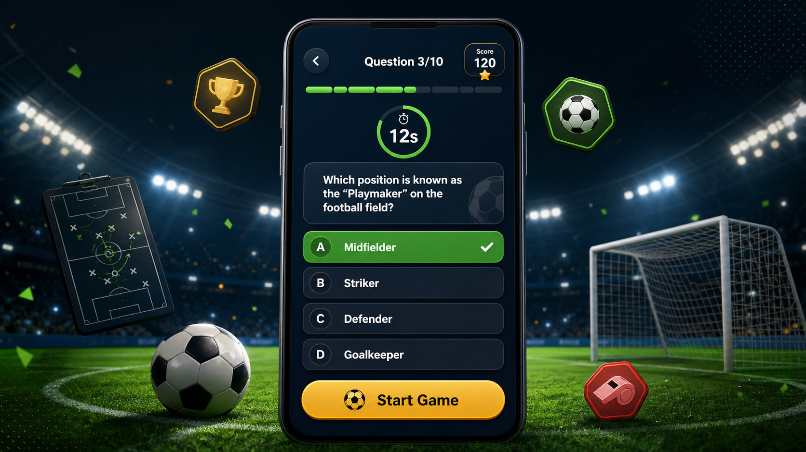

# Costa Trivia Quiz

Costa Trivia Quiz is a beginner-friendly Flutter football trivia game with a
modern mobile UI, timed questions, Firestore-backed content, and a local
leaderboard.

## Features



- Player name input before each game
- Category selection: Premier League, Champions League, World Cup, Players, Rules, International, Clubs, and Managers
- Difficulty selection: Easy, Medium, and Hard
- Randomized question sessions with no repeats in a single game
- Countdown timer for every question
- Auto-move when the timer runs out
- Instant answer feedback with green/red highlighting
- Correct answer reveal after wrong answers or timeout
- Score system with correct-answer points, wrong-answer penalty, and speed bonus
- Final result screen with performance message
- Local leaderboard saved with SharedPreferences
- Firestore question fetching with local fallback questions
- Upload script for importing `questions.json` into Firestore
- Simple built-in sound feedback

## Project Structure

```text
assets/
└── images/
lib/
├── data/
├── models/
├── screens/
├── services/
└── widgets/
```

## Generated Artwork

- `assets/images/profile_picture.png` - square profile/app image
- `assets/images/quiz_ui_hero.png` - wide UI artwork for the app and README

## Firestore Questions

The app reads active quiz questions from the Firestore `questions` collection.
Each document should use this shape:

```json
{
  "question": "Who won the 2018 FIFA World Cup?",
  "options": ["France", "Brazil", "Germany", "Argentina"],
  "answerIndex": 0,
  "category": "World Cup",
  "difficulty": "easy",
  "isActive": true
}
```

The repository includes `questions.json` with 150 football trivia questions.

## Upload Questions To Firestore

Install Node dependencies:

```bash
npm.cmd install
```

Place your Firebase Admin SDK service account file in the project root as:

```text
serviceAccountKey.json
```

Then upload:

```bash
npm.cmd run upload:questions
```

Important: `serviceAccountKey.json` is ignored by git and should never be uploaded
to GitHub.

## Firebase Setup

Before running against Firestore, configure Firebase for Flutter from the project
folder:

```bash
dart pub global activate flutterfire_cli
flutterfire configure
```

That command creates `lib/firebase_options.dart` and platform Firebase config files.
The app also includes fallback questions, so it can still open before Firebase is configured.

## Run The App

1. Install Flutter from https://docs.flutter.dev/get-started/install
2. Open this folder in a terminal.
3. Install Flutter packages:

   ```bash
   flutter pub get
   ```

4. Run the app:

   ```bash
   flutter run
   ```

If multiple devices are connected, list them with:

```bash
flutter devices
```

Then run on a specific device:

```bash
flutter run -d DEVICE_ID
```

## Verification

```bash
flutter analyze
flutter test
```
